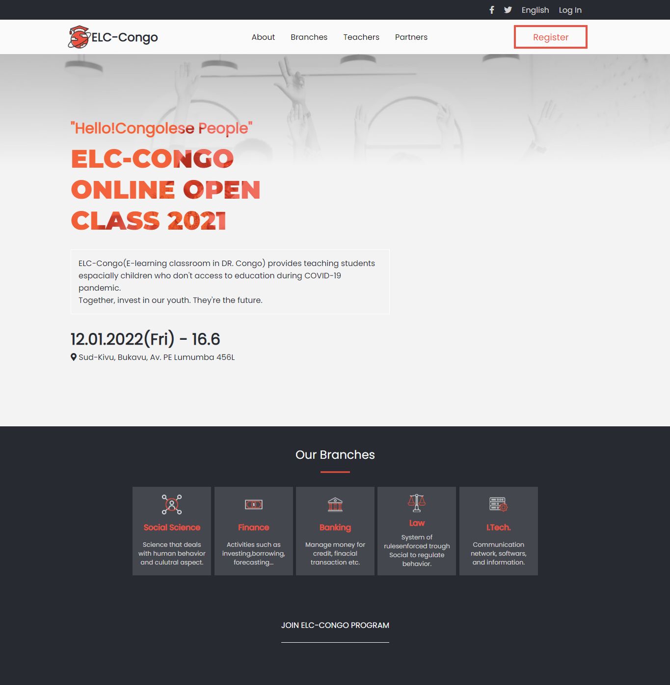
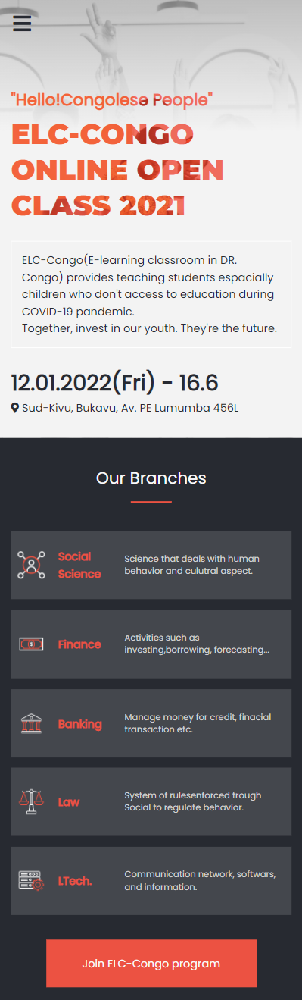

# ELC-Congo-First-capston-project
ELC-Congo it's a e-learning template. My capstone for HTML/CSS module.

This is a screenshot of my capstone

 

## Built With

- HTML
- CSS
- Javascript

### Prerequisites

clone repo: `git clone https://github.com/Kandy-Peter/ELC-Congo-First-capston-project.git`

###Live
 To see live project go to: [Live_demo](https://kandy-peter.github.io/ELC-Congo-First-capston-project/)
### Install

 run `npm install` to install dependencies

###Project demo

check this [Loom]() link to watch the video.
## Command

These commands are here to help you for how to check errors in your code using Linter

*to install the webhint run `npm init -y` to initialize the package and create `package.json`

 then run `npm install --save-dev hint@6.x`
 After creating the `.hintrc` file, run `npx hint .` to ckeck if there's an error.

*to install the stylelint that help you to avoid errors in styles code run:
    `npm install --save-dev stylelint@13.x stylelint-scss@3.x stylelint-config-standard@21.x stylelint-csstree-validator@1.x`
 Then run `npx stylelint "**/*.{css,scss}"` after creating a `.stylelint.json` file

* To install Eslint run `npm install --save-dev eslint@7.x eslint-config-airbnb-base@14.x eslint-plugin-import@2.x babel-eslint@10.x`
And to fix lint errors run `npx eslint .`

## Licences :

- The original template is from: [Cindy Shin in Behance](https://www.behance.net/gallery/29845175/CC-Global-Summit-2015).

- Images downloaded from [freepik.com]('https://www.freepik.com/photos/school).

